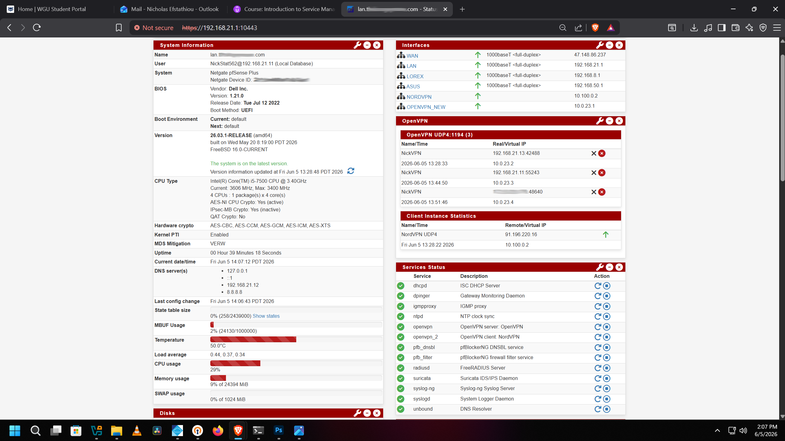

# 🔒 pfSense + TrueNAS Home Lab

A fully production-deployed, segmented home network built on dedicated hardware running **Netgate pfSense Plus** and a self-hosted **TrueNAS Scale** NAS server. Core services run on bare metal, with additional virtualized workloads hosted through the TrueNAS Scale KVM hypervisor. The environment supports 20+ active devices across multiple isolated network segments.

---

## 🧰 Technologies & Tools

| Category | Technology |
|---|---|
| Firewall / Router | Netgate pfSense Plus 26.03 (FreeBSD 16.0) |
| Firewall Hardware | Dell Inc.; Intel Core i5-7500 @ 3.40GHz, AES-NI enabled |
| Network Interface Card | Intel I350-T4 1GbE Quad-Port NIC |
| Switching | TP-Link 24-Port Gigabit Managed Switch |
| VPN | OpenVPN (certificate-based) + NordVPN client |
| IDS/IPS | Suricata with live threat rulesets |
| DNS Filtering | Pi-hole (network-wide, 50%+ block rate) |
| Wireless Auth | FreeRADIUS / 802.1X |
| SSL/TLS | ACME auto-renewing certificates |
| NAS | TrueNAS Scale; Intel Core i7-6700, 62.7GB RAM, 18TB |
| Private Cloud | Nextcloud (locked behind OpenVPN tunnel) |
| Media Server | Plex Media Server |
| DNS Blocker | pfBlockerNG DNSBL |
| GeoIP Intelligence | MaxMind GeoLite2 (Suricata + pfBlockerNG) |
| Hypervisor | KVM (Type 1, bare-metal on TrueNAS Scale) |

---

## 🔌 Physical Network Infrastructure

The pfSense firewall runs on dedicated Dell hardware equipped with an **Intel I350-T4 1GbE Quad-Port NIC**, providing separate physical interfaces for WAN and segmented internal networks. All network segments connect through a **24-port Gigabit managed switch**, supporting VLAN separation, device isolation, and centralized network management.

## 🖥️ pfSense Dashboard & Network Overview

pfSense Plus dashboard showing all active interfaces, live OpenVPN tunnel sessions, and running services. The network has been live for **20+ days of continuous uptime** with all core services healthy and operational.

**Active Interfaces:**
- `WAN`; 1000baseT full-duplex (internet uplink)
- `LAN`; 192.168.21.1/24 (main trusted devices)
- `LOREX`; 192.168.8.1/24 (IP camera system; isolated)
- `ASUS`; 192.168.50.1/24 (Wi-Fi network; isolated)
- `OPENVPN_NEW`; 10.0.23.1/24 (VPN tunnel network)

**All services running:** dhcpd, OpenVPN server, OpenVPN client (NordVPN), Suricata IDS/IPS, FreeRADIUS, pfBlockerNG, NTP, IGMP proxy, DNS Resolver, syslog

---

## 🔐 OpenVPN Server Configuration

OpenVPN server configured directly in pfSense for secure remote access. Tunnels use **AES-256 encryption** for all data in transit.

---

## 👥 OpenVPN Active Client Connections

Live view of the pfSense OpenVPN status page showing two separate VPN functions running simultaneously: an inbound remote access server with three active client sessions, and an outbound NordVPN client tunnel routing all internet traffic through an encrypted connection.

**Active inbound sessions (ovpns2, UDP 1194):**
- Nick's phone connecting remotely from WAN over AES-256-GCM
- Android TV Box connected locally for Plex streaming over AES-256-GCM
- Nick's PC connected locally for NAS access over AES-256-GCM

**Outbound NordVPN client (ovpnc1):**
- Status: Connected (Success) over UDP4 to a NordVPN server
- All outbound internet traffic from the network is routed through the encrypted NordVPN tunnel at the firewall level, meaning no individual device needs a VPN app installed

---

## 🏅 SSL/TLS Certificate Management (ACME)

ACME certificate manager in pfSense handling automatic issuance and renewal of valid SSL/TLS certificates for all internal self-hosted services. Eliminates browser security warnings across the network without exposing services to the public internet.

---

## 📶 WPA2-Enterprise Wireless Authentication (FreeRADIUS / 802.1X)

Most home networks run WPA2-Personal, which means every device shares the same password. This network runs **WPA2-Enterprise with EAP-TTLS**, the same authentication standard used by corporate and university environments. FreeRADIUS is configured directly on pfSense and issues individual credential-based authentication challenges to every device that tries to connect to the wireless network.

The ASUS RT-AC3100 operates in **Access Point mode** and offloads all authentication decisions to the FreeRADIUS server at 192.168.21.1 over UDP port 1812. The Windows Wi-Fi properties panel in the screenshot confirms the connection is authenticated via **Microsoft: EAP-TTLS**, which verifies the client is talking to the correct RADIUS server before credentials are ever exchanged.

This means no shared password exists on the network. Each user authenticates with their own credentials, failed attempts are logged centrally in pfSense, and rogue devices cannot join even if they know the SSID.

---

## 🛡️ Suricata IDS/IPS; Interface Configuration

Suricata IDS/IPS deployed across **all network interfaces**; WAN, LAN, ASUS, and LOREX segments run independent inspection engines. Each interface monitors traffic in real-time with automated threat blocking enabled, meaning malicious traffic is not just detected but actively dropped. GeoIP lookups are powered by the **MaxMind GeoLite2** database, allowing Suricata to correlate alerts with source country data for richer threat context.

---

## 🚨 Suricata Live Threat Alerts

Live Suricata alert log showing real detections including **port scans**, **MySQL/PostgreSQL inbound probe attempts**, **NMAP scan detection**, and other suspicious traffic patterns. This demonstrates the IDS/IPS actively catching reconnaissance activity and automated attack attempts against the network in real time.

---

## 🌐 WAN Firewall Rules

WAN ruleset built on a **minimal attack surface / default deny** philosophy. Only two inbound ports are intentionally open to the internet:

| Rule | Protocol | Port | Destination | Purpose |
|---|---|---|---|---|
| ✅ Allow | IPv4 UDP | 1194 (OpenVPN) | WAN address | Remote VPN access |
| ✅ Allow | IPv4 TCP | 32400 (Plex) | 192.168.21.12 | Plex Media Server remote streaming |
| ✅ NAT | IPv4 TCP/UDP | 53 (DNS) | 192.168.21.12 | Pi-Hole DNS forwarding |
| ❌ Block | * | * | RFC 1918 networks | Block all private network spoofing |
| ❌ Block | * | * | Bogon networks | Block reserved/unassigned address space |
| ❌ Block | IPv6 | * | * | IPv6 fully disabled and blocked |
| ❌ Block | IPv4 | * | WAN address | Block all other unsolicited inbound traffic |

ICMP and IGMP are selectively permitted for network diagnostics only via IGMPNetworks alias. All other inbound traffic is rejected by implicit default deny.

---

## 🏠 LAN Firewall Rules

LAN rules are organized into labeled sections for clarity. All outbound traffic from LAN subnets is routed through the NORDVPN_VPNV4 gateway, meaning every device on the network exits through the encrypted NordVPN tunnel without any per-device configuration. The same ruleset is mirrored on the LOREX (camera system) and ASUS (Wi-Fi) interfaces to ensure consistent policy across all isolated network zones.

| Section | Protocol | Port | Gateway | Description |
|---|---|---|---|---|
| Anti-Lockout | IPv4 TCP | 10443 | default | Admin access protection; prevents lockout from LAN |
| NAT | IPv4 UDP | 53 (DNS) | default | Force all DNS through Pi-Hole at 192.168.21.12 |
| SSH | IPv4 TCP | 22222 | default | SSH access to pfSense local management only |
| DNS | IPv4 UDP/TCP | 53 / 853 (DoT) | default | Pi-Hole DNS outgoing + DNS-over-TLS via Pi-Hole |
| HTTP/HTTPS | IPv4 TCP | 80 / 443 | NORDVPN_VPNV4 | All standard web traffic routed through NordVPN tunnel |
| HTTPS | IPv4 TCP | 10443 | default | pfSense and Asus Router secure config access |
| NTP | IPv4 UDP | 123 | default | Time sync to LAN address and LAN subnets |
| RADIUS | IPv4 UDP | 1812 | default | FreeRADIUS auth server at 192.168.21.1 |
| VPN | IPv4 UDP | 1194 (OpenVPN) | default | LAN to OPENVPN_NEW subnets |
| Plex | IPv4 TCP | 32400 | default | TrueNAS Plex server at 192.168.21.12 |
| TrueNAS | IPv4 TCP/UDP | * | default | TrueNAS all outgoing (192.168.21.12) |
| IGMP/ICMP | IPv4 IGMP/ICMP | * | default | Multicast and diagnostic traffic via IGMPNetworks alias |
| ❌ Block | IPv4 | * | * | Block WAN subnets from entering LAN; hard isolation |

> **Note:** LOREX (IP camera system, 192.168.8.x) and ASUS Wi-Fi (192.168.50.x) run identical firewall rulesets, ensuring IoT devices and wireless clients are held to the same strict traffic policy as the main LAN with no inter-VLAN communication unless explicitly permitted.

---

## 🚫 pfBlockerNG IP Blocking & GeoIP

pfBlockerNG runs on pfSense as a dedicated IP reputation and GeoIP blocking layer. It pulls from multiple real-world threat intelligence feeds and blocks malicious IPs at the firewall level before they ever reach the network. GeoIP enforcement is powered by the **MaxMind GeoLite2** database, which pfBlockerNG uses to resolve IP addresses to countries and apply regional blocks. Selected countries are blocked entirely at the firewall level, adding a layer of protection that operates independently from Pi-hole.

Pi-hole handles DNS-based blocking while pfBlockerNG handles IP and GeoIP-based blocking. The two run alongside each other so anything Pi-hole misses at the DNS layer, pfBlockerNG can catch at the network layer.

**Active threat feeds visible in screenshot:**
- `CINS_army_v4` — CINS Army known bad actors
- `ET_Block_v4` — Emerging Threats IP blocklist
- `ISC_Block_v4` — SANS Internet Storm Center blocklist
- `Spamhaus_Drop_v4` — Spamhaus DROP list
- `RU_v4` — Russia GeoIP block

**Countries blocked in this snapshot:** CH, US (flagged IPs), RU, BG, RO, NL, GB, LU, AE

---

## 🗄️ TrueNAS Server Dashboard

TrueNAS Scale running on dedicated bare-metal hardware:

- **CPU:** Intel Core i7-6700
- **RAM:** 62.7 GB
- **Storage:** 18TB across two drives
- **Role:** NAS and Type 1 KVM virtualization hypervisor with Plex Media Server, Pi-hole, and Nextcloud.

---

## 📦 TrueNAS Installed Apps

Containerized applications running on TrueNAS Scale:

- **Nextcloud**; private self-hosted cloud storage
- **Pi-hole**; network-wide DNS ad/tracker blocking
- **Plex**; local and remote media streaming

---

## ☁️ Nextcloud Private Cloud Storage

Nextcloud deployed on TrueNAS as a fully private alternative to Google Drive or iCloud. Access is locked behind the **OpenVPN tunnel** with role-based permissions; files are never stored on third-party infrastructure.

---

## 🚫 Pi-hole DNS Filtering

Pi-hole running on TrueNAS handling **network-wide DNS filtering** across all connected devices:

- **69,917** total DNS queries processed
- **34,996 blocked (50.1%)**; ads, trackers, and malicious domains
- **2,146,983 domains** on the blocklist
- Forced via pfSense NAT rule; no device can bypass it

---

## 🎬 Plex Media Server

Plex Media Server running on TrueNAS serving a local media library across the home network and remotely through a controlled port forward rule (TCP 32400) on pfSense WAN.

---

## 🖥️ Type 1 Hypervisor & VM Deployment

TrueNAS Scale functions as a **KVM-based Type 1 bare-metal hypervisor**. Provisioned an Ubuntu Desktop 22.04 VM with dedicated compute and storage resources for running self-hosted security tooling and lab environments directly on the NAS hardware.

---

## 🙋 Author

**Nicholas Efstathiou**  
Cybersecurity | Network Engineering | Home Lab  
[LinkedIn](https://www.linkedin.com/in/NickStat23)
