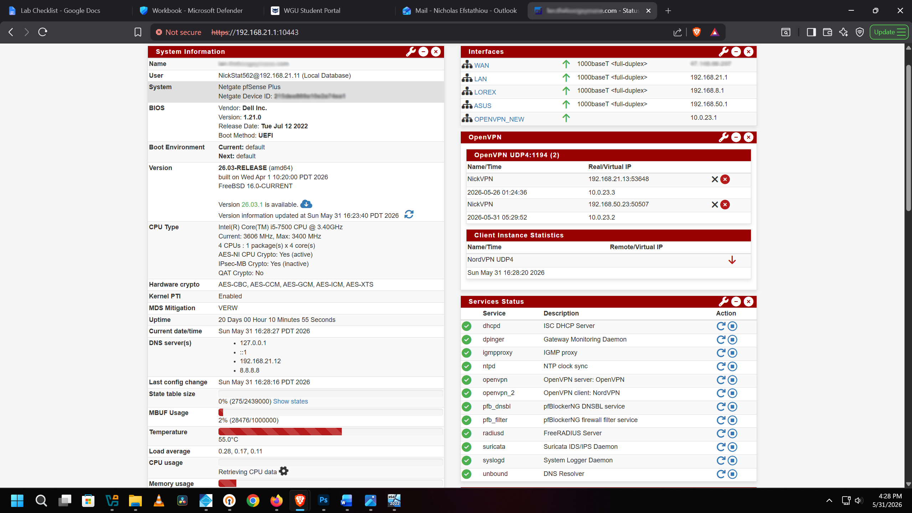
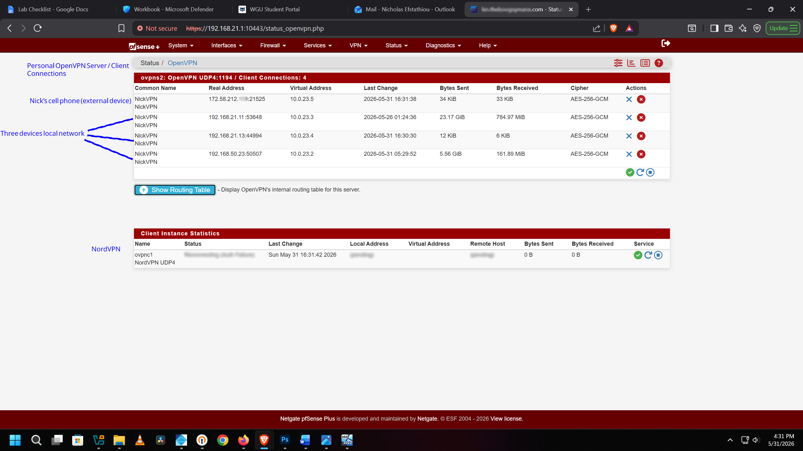
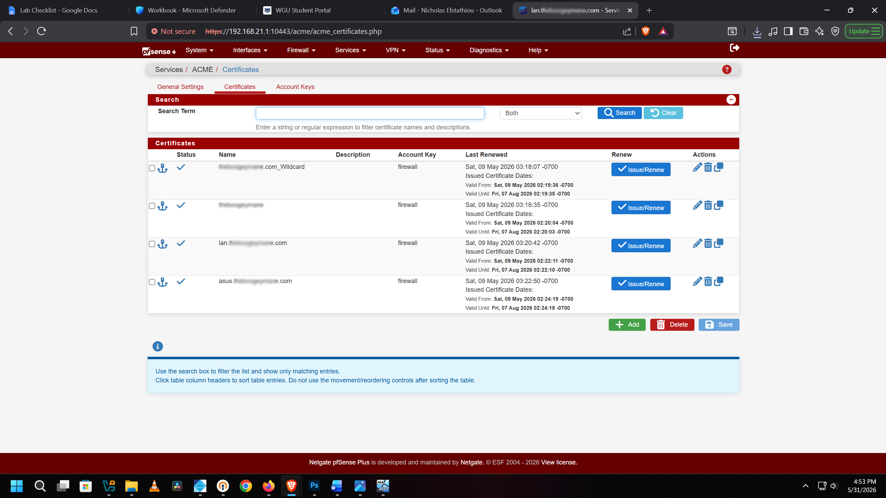
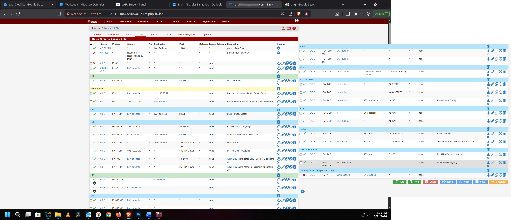

# 🔒 pfSense + TrueNAS Home Lab

A fully production-deployed, segmented home network built on dedicated hardware running **Netgate pfSense Plus** and a self-hosted **TrueNAS Scale** NAS server. Core services run on bare metal, with additional virtualized workloads hosted through the TrueNAS Scale KVM hypervisor. The environment supports 20+ active devices across multiple isolated network segments.

---

## 🧰 Technologies & Tools

| Category | Technology |
|---|---|
| Firewall / Router | Netgate pfSense Plus 26.03 (FreeBSD 16.0) |
| Firewall Hardware | Dell Inc.; Intel Core i5-7500 @ 3.40GHz, AES-NI enabled |
| Network Interface Card | Intel I350-T4 1GbE Quad-Port NIC |
| Switching | 24-Port Gigabit Managed Switch |
| VPN | OpenVPN (certificate-based) + NordVPN client |
| IDS/IPS | Suricata with live threat rulesets |
| DNS Filtering | Pi-hole (network-wide, 50%+ block rate) |
| Wireless Auth | FreeRADIUS / 802.1X |
| SSL/TLS | ACME auto-renewing certificates |
| NAS | TrueNAS Scale; Intel Core i7-6700, 62.7GB RAM, 18TB |
| Private Cloud | Nextcloud (locked behind OpenVPN tunnel) |
| Media Server | Plex Media Server |
| DNS Blocker | pfBlockerNG DNSBL |
| Hypervisor | KVM (Type 1, bare-metal on TrueNAS Scale) |

---

## 🔌 Physical Network Infrastructure

The pfSense firewall runs on dedicated Dell hardware equipped with an **Intel I350-T4 1GbE Quad-Port NIC**, providing separate physical interfaces for WAN and segmented internal networks. All network segments connect through a **24-port Gigabit managed switch**, supporting VLAN separation, device isolation, and centralized network management.

## 🖥️ pfSense Dashboard & Network Overview

pfSense Plus dashboard showing all active interfaces, live OpenVPN tunnel sessions, and running services. The network has been live for **20+ days of continuous uptime** with all core services healthy and operational.

**Active Interfaces:**
- `WAN`; 1000baseT full-duplex (internet uplink)
- `LAN`; 192.168.21.1/24 (main trusted devices)
- `LOREX`; 192.168.8.1/24 (IP camera system; isolated)
- `ASUS`; 192.168.50.1/24 (Wi-Fi network; isolated)
- `OPENVPN_NEW`; 10.0.23.1/24 (VPN tunnel network)

**All services running:** dhcpd, OpenVPN server, OpenVPN client (NordVPN), Suricata IDS/IPS, FreeRADIUS, pfBlockerNG, NTP, IGMP proxy, DNS Resolver, syslog

---

## 🔐 OpenVPN Server Configuration

OpenVPN server configured directly in pfSense for secure remote access. Tunnels use **AES-256 encryption** for all data in transit.

---

## 👥 OpenVPN Active Client Connections

Live view of active OpenVPN client sessions showing multiple devices tunneled back into the home network remotely. Displays real IP addresses, virtual tunnel IPs (10.0.23.x range), bytes transferred per session, and cipher negotiated.

---

## 🏅 SSL/TLS Certificate Management (ACME)

ACME certificate manager in pfSense handling automatic issuance and renewal of valid SSL/TLS certificates for all internal self-hosted services. Eliminates browser security warnings across the network without exposing services to the public internet.

---

## 🛡️ Suricata IDS/IPS; Interface Configuration

Suricata IDS/IPS deployed across **all network interfaces**; WAN, LAN, ASUS, and LOREX segments run independent inspection engines. Each interface monitors traffic in real-time with automated threat blocking enabled, meaning malicious traffic is not just detected but actively dropped.

---

## 🚨 Suricata Live Threat Alerts

Live Suricata alert log showing real detections including **port scans**, **MySQL/PostgreSQL inbound probe attempts**, **NMAP scan detection**, and other suspicious traffic patterns. This demonstrates the IDS/IPS actively catching reconnaissance activity and automated attack attempts against the network in real time.

---

## 🌐 WAN Firewall Rules

WAN ruleset built on a **minimal attack surface / default deny** philosophy. Only two inbound ports are intentionally open to the internet:

| Rule | Protocol | Port | Destination | Purpose |
|---|---|---|---|---|
| ✅ Allow | IPv4 UDP | 1194 (OpenVPN) | WAN address | Remote VPN access |
| ✅ Allow | IPv4 TCP | 32400 (Plex) | 192.168.21.12 | Plex Media Server remote streaming |
| ✅ NAT | IPv4 TCP/UDP | 53 (DNS) | 192.168.21.12 | Pi-Hole DNS forwarding |
| ❌ Block | * | * | RFC 1918 networks | Block all private network spoofing |
| ❌ Block | * | * | Bogon networks | Block reserved/unassigned address space |
| ❌ Block | IPv6 | * | * | IPv6 fully disabled and blocked |
| ❌ Block | IPv4 | * | WAN address | Block all other unsolicited inbound traffic |

ICMP and IGMP are selectively permitted for network diagnostics only via IGMPNetworks alias. All other inbound traffic is rejected by implicit default deny.

---

## 🏠 LAN Firewall Rules

LAN rules are organized into labeled sections for clarity. The same ruleset is mirrored on the **LOREX (camera system)** and **ASUS (Wi-Fi)** interfaces to ensure consistent policy across all isolated network zones.

| Section | Protocol | Port | Description |
|---|---|---|---|
| Anti-Lockout | IPv4 TCP | 10443 | Admin access protection; prevents lockout from LAN |
| NAT | IPv4 UDP | 53 (DNS) | Force all DNS through Pi-Hole at 192.168.21.12 |
| SSH | IPv4 TCP | 22222 | SSH access to pfSense local management only |
| DNS | IPv4 UDP/TCP | 53 / 853 (DoT) | Pi-Hole DNS outgoing + DNS-over-TLS via Pi-Hole |
| DNS | IPv4 UDP/TCP | 53 / 853 | Allow fallback to external DNS (Google, Cloudflare) |
| HTTP/HTTPS | IPv4 TCP | 80 / 443 | Standard web traffic from LAN subnets |
| HTTP/HTTPS | IPv4 TCP | 10443 | Asus Router config portal at 192.168.50.10 |
| NTP | IPv4 UDP | 123 | Time sync to LAN address + LAN subnets |
| RADIUS | IPv4 UDP | 1812 | FreeRADIUS auth server at 192.168.21.1 |
| RADIUS | IPv4 UDP | 1812 | Asus router RADIUS verification at 192.168.50.10 |
| VPN | IPv4 UDP | 1194 (OpenVPN) | LAN to OPENVPN_NEW subnets |
| Plex | IPv4 TCP | 32400 | TrueNAS Plex server at 192.168.21.12 |
| TrueNAS | IPv4 TCP/UDP | * | TrueNAS all outgoing (192.168.21.12) |
| IGMP/ICMP | IPv4 IGMP/ICMP | * | Multicast and diagnostic traffic via IGMPNetworks alias |
| ❌ Block | IPv4 | * | Block WAN subnets from entering LAN; hard isolation |

> **Note:** LOREX (IP camera system, 192.168.8.x) and ASUS Wi-Fi (192.168.50.x) run identical firewall rulesets, ensuring IoT devices and wireless clients are held to the same strict traffic policy as the main LAN with no inter-VLAN communication unless explicitly permitted.

---

## 🗄️ TrueNAS Server Dashboard

TrueNAS Scale running on dedicated bare-metal hardware:

- **CPU:** Intel Core i7-6700
- **RAM:** 62.7 GB
- **Storage:** 18TB across two drives
- **Role:** NAS and Type 1 KVM virtualization hypervisor with Plex Media Server, Pi‑hole, and Nextcloud.

---

## 📦 TrueNAS Installed Apps

Containerized applications running on TrueNAS Scale:

- **Nextcloud**; private self-hosted cloud storage
- **Pi-hole**; network-wide DNS ad/tracker blocking
- **Plex**; local and remote media streaming

---

## ☁️ Nextcloud Private Cloud Storage

Nextcloud deployed on TrueNAS as a fully private alternative to Google Drive or iCloud. Access is locked behind the **OpenVPN tunnel** with role-based permissions; files are never stored on third-party infrastructure.

---

## 🚫 Pi-hole DNS Filtering

Pi-hole running on TrueNAS handling **network-wide DNS filtering** across all connected devices:

- **69,917** total DNS queries processed
- **34,996 blocked (50.1%)**; ads, trackers, and malicious domains
- **2,146,983 domains** on the blocklist
- Forced via pfSense NAT rule; no device can bypass it

---

## 🎬 Plex Media Server

Plex Media Server running on TrueNAS serving a local media library across the home network and remotely through a controlled port forward rule (TCP 32400) on pfSense WAN.

---

## 🖥️ Type 1 Hypervisor & VM Deployment

TrueNAS Scale functions as a **KVM-based Type 1 bare-metal hypervisor**. Provisioned an Ubuntu Desktop 22.04 VM with dedicated compute and storage resources for running self-hosted security tooling and lab environments directly on the NAS hardware.

---

## 🙋 Author

**Nick Efstathiou**  
Cybersecurity | Network Engineering | Home Lab  
[LinkedIn](https://www.linkedin.com/in/NickStat23)
