# 🔒 pfSense + TrueNAS Home Lab

A production home network running on dedicated hardware with **Netgate pfSense Plus** as the firewall/router and a self-hosted **TrueNAS Scale** server handling storage and virtualization. Everything runs on bare metal across multiple isolated network segments supporting 20+ active devices.

> 🗓️ **Started in 2021 on an older Intel i5 PC that didn't have AES-NI support, so it couldn't handle the cryptography needed to actually run an OpenVPN server. Started off on IPFire, switched to pfSense after a few months, and pretty quickly figured out I needed the right hardware to go with it. Picked up this Dell with a compatible i5 processor, threw in an Intel I350 NIC, and made sure I had enough RAM to run everything without it falling apart. TrueNAS was added around June 2025. Both systems are always getting upgraded, new software, new configs, this project never really has a finish line.
---

## 🧰 Technologies & Tools

| Category | Technology |
|---|---|
| Firewall / Router | Netgate pfSense Plus 26.03 (FreeBSD 16.0) |
| Firewall Hardware | Dell Inc.; Intel Core i5-7500 @ 3.40GHz, AES-NI enabled |
| Network Interface Card | Intel I350-T4 1GbE Quad-Port NIC |
| Switching | TP-Link 24-Port Gigabit Managed Switch |
| VPN | OpenVPN (certificate-based) + NordVPN client |
| IDS/IPS | Suricata with live threat rulesets |
| DNS Filtering | Pi-hole (network-wide, 50%+ block rate) |
| Wireless Auth | FreeRADIUS / 802.1X |
| SSL/TLS | ACME auto-renewing certificates |
| NAS | TrueNAS Scale; Intel Core i7-6700, 62.7GB RAM, 18TB |
| Private Cloud | Nextcloud (locked behind OpenVPN tunnel) |
| Media Server | Plex Media Server |
| DNS Blocker | pfBlockerNG DNSBL |
| GeoIP Intelligence | MaxMind GeoLite2 (Suricata + pfBlockerNG) |
| Hypervisor | KVM (Type 1, bare-metal on TrueNAS Scale) |

---

## 🔌 Physical Network Infrastructure

The firewall runs on dedicated Dell hardware with an **Intel I350-T4 Quad-Port NIC**, giving each network segment its own physical interface. Everything connects through a **24-port Gigabit managed switch** with VLAN separation and device isolation.

---

## 🖥️ pfSense Dashboard & Network Overview

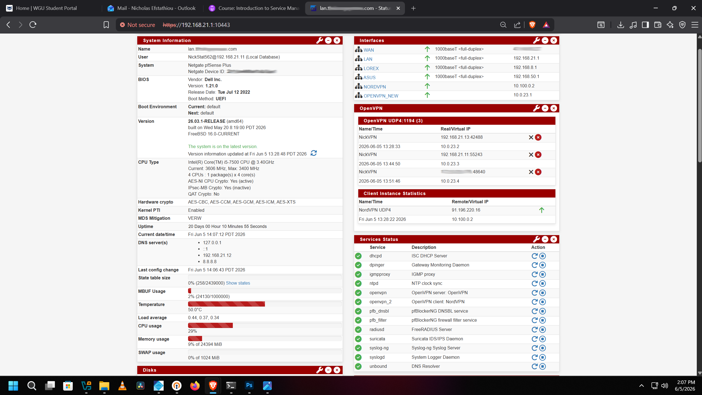

pfSense dashboard showing all active interfaces, live OpenVPN sessions, and running services. Network has been up for **20+ days of continuous uptime** with everything healthy.

**Active Interfaces:**
- `WAN`; 1000baseT full-duplex (internet uplink)
- `LAN`; 192.168.21.1/24 (main trusted devices)
- `LOREX`; 192.168.8.1/24 (IP camera system; isolated)
- `ASUS`; 192.168.50.1/24 (Wi-Fi network; isolated)
- `OPENVPN_NEW`; 10.0.23.1/24 (VPN tunnel network)

**All services running:** dhcpd, OpenVPN server, OpenVPN client (NordVPN), Suricata IDS/IPS, FreeRADIUS, pfBlockerNG, NTP, IGMP proxy, DNS Resolver, syslog

---

## 🌐 WAN Firewall Rules

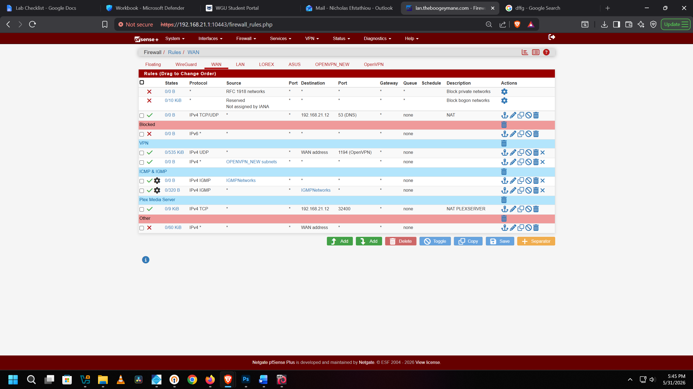

WAN ruleset is built around a **default deny / minimal attack surface** approach. Only two ports are intentionally open to the internet:

| Rule | Protocol | Port | Destination | Purpose |
|---|---|---|---|---|
| ✅ Allow | IPv4 UDP | 1194 (OpenVPN) | WAN address | Remote VPN access |
| ✅ Allow | IPv4 TCP | 32400 (Plex) | 192.168.21.12 | Plex Media Server remote streaming |
| ✅ NAT | IPv4 TCP/UDP | 53 (DNS) | 192.168.21.12 | Pi-Hole DNS forwarding |
| ❌ Block | * | * | RFC 1918 networks | Block all private network spoofing |
| ❌ Block | * | * | Bogon networks | Block reserved/unassigned address space |
| ❌ Block | IPv6 | * | * | IPv6 fully disabled and blocked |
| ❌ Block | IPv4 | * | WAN address | Block all other unsolicited inbound traffic |

ICMP and IGMP are allowed selectively for diagnostics via the IGMPNetworks alias. Everything else is dropped by default deny.

---

## 🏠 LAN Firewall Rules

All outbound LAN traffic is routed through the NORDVPN_VPNV4 gateway, so every device on the network exits through NordVPN at the firewall level with no per-device configuration needed. The same ruleset runs on the LOREX and ASUS interfaces so nothing gets treated differently across segments.

| Section | Protocol | Port | Gateway | Description |
|---|---|---|---|---|
| Anti-Lockout | IPv4 TCP | 10443 | default | Prevents accidental admin lockout from LAN |
| ANY | IPv4 ANY | ANY | NORDVPN_VPNV4 | All traffic routed through NordVPN tunnel |
| NAT | IPv4 UDP | 53 (DNS) | default | Force all DNS through Pi-Hole at 192.168.21.12 |
| SSH | IPv4 TCP | 22222 | default | SSH access to pfSense local management only |
| DNS | IPv4 UDP/TCP | 53 / 853 (DoT) | default | Pi-Hole DNS outgoing + DNS-over-TLS via Pi-Hole |
| HTTP/HTTPS | IPv4 TCP | 80 / 443 | default | Allow Hypertext Transfer Protocol/Secure |
| NTP | IPv4 UDP | 123 | default | Time sync to LAN address and LAN subnets |
| RADIUS | IPv4 UDP | 1812 | default | FreeRADIUS auth server at 192.168.21.1 |
| VPN | IPv4 UDP | 1194 (OpenVPN) | default | LAN to OPENVPN_NEW subnets |
| Plex | IPv4 TCP | 32400 | default | TrueNAS Plex server at 192.168.21.12 |
| TrueNAS | IPv4 TCP/UDP | * | default | TrueNAS all outgoing (192.168.21.12) |
| IGMP/ICMP | IPv4 IGMP/ICMP | * | default | Multicast and diagnostic traffic via IGMPNetworks alias |
| ❌ Block | IPv4 | * | * | Block WAN subnets from entering LAN; hard isolation |

> **Note:** LOREX (192.168.8.x) and ASUS Wi-Fi (192.168.50.x) run the same ruleset as LAN. No inter-VLAN communication unless explicitly permitted.

---

## 🔐 OpenVPN Server Configuration

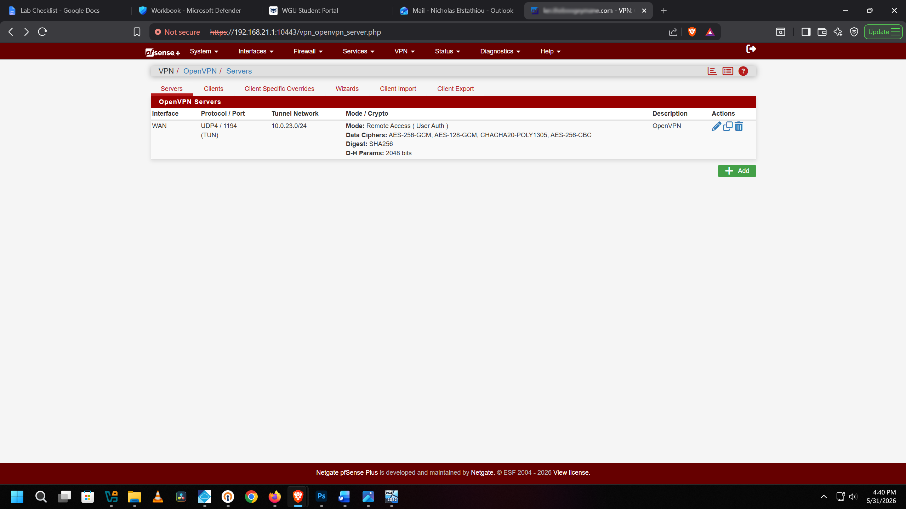

OpenVPN server running directly on pfSense for remote access. All tunnels use **AES-256 encryption** end to end.

---

## 👥 OpenVPN Active Client Connections

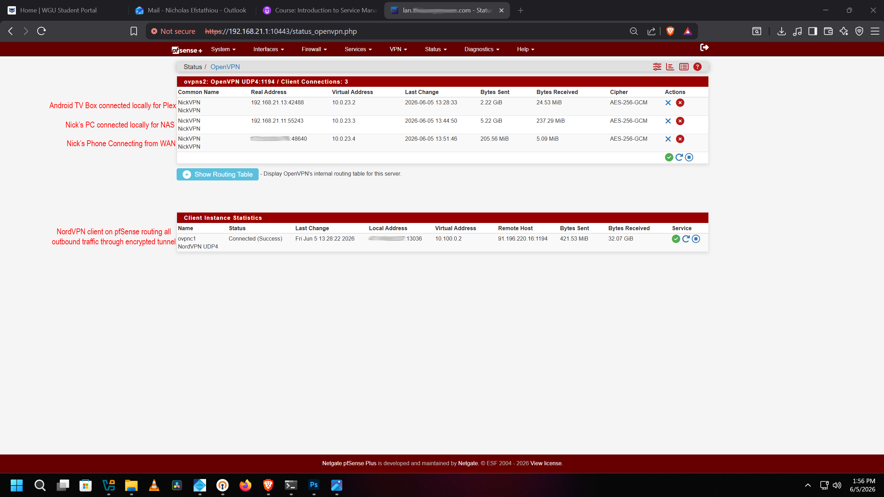

Live OpenVPN status showing two things running at the same time: an inbound remote access server with three active client sessions, and an outbound NordVPN tunnel routing all internet traffic out through an encrypted connection.

**Active inbound sessions (ovpns2, UDP 1194):**
- Nick's phone connecting remotely from WAN over AES-256-GCM
- Android TV Box connected locally for Plex streaming over AES-256-GCM
- Nick's PC connected locally for NAS access over AES-256-GCM

**Outbound NordVPN client (ovpnc1):**
- Status: Connected over UDP4 to a NordVPN server
- All outbound traffic from the network routes through NordVPN at the firewall level, no VPN app needed on any device

---

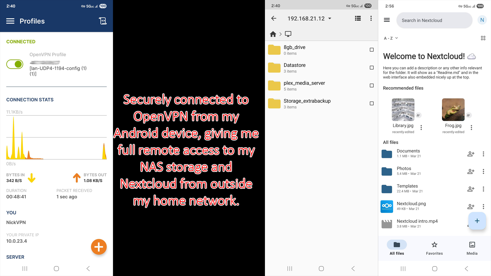

Three screens showing full remote access from my Android phone. Left: OpenVPN connected as "NickVPN" on UDP4-1194 with tunnel IP 10.0.23.4, running for 48 minutes with live throughput. Middle: browsing TrueNAS directly at 192.168.21.12 with all shares visible (8gb_drive, Datastore, plex_media_server, Storage_extrabackup). Right: Nextcloud fully accessible with all personal files and folders, everything tunneled through OpenVPN from outside the home network.

---

## 🏅 SSL/TLS Certificate Management (ACME)

ACME handles automatic SSL/TLS certificate issuance and renewal for all internal self-hosted services. No browser security warnings anywhere on the network and nothing exposed to the public internet.

---

## 📶 WPA2-Enterprise Wireless Authentication (FreeRADIUS / 802.1X)

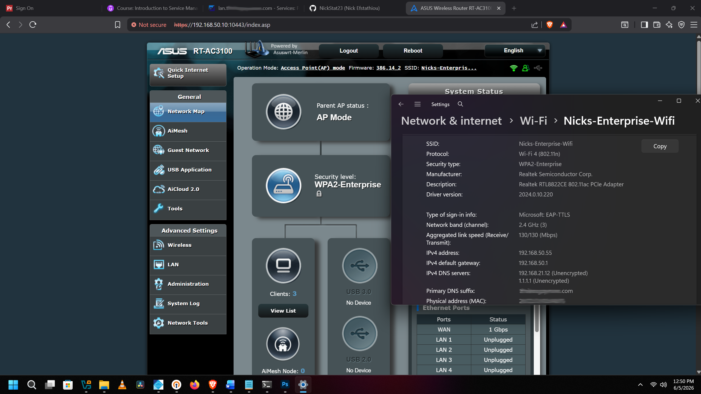

Most home networks use WPA2-Personal where everyone shares the same password. This network runs **WPA2-Enterprise with EAP-TTLS**, the same standard used in corporate and university environments. FreeRADIUS is configured directly on pfSense and every device that connects to Wi-Fi gets its own individual authentication challenge.

The ASUS RT-AC3100 runs in **Access Point mode** and hands all auth decisions off to the FreeRADIUS server at 192.168.21.1 over UDP 1812. The Windows Wi-Fi panel in the screenshot shows the connection authenticated via **Microsoft: EAP-TTLS**, which confirms the client verified it was talking to the correct RADIUS server before any credentials were sent.

No shared password exists on this network. Every user has their own credentials, failed attempts are logged in pfSense, and unknown devices can't join even if they know the SSID.

---

## 🛡️ Suricata IDS/IPS Interface Configuration

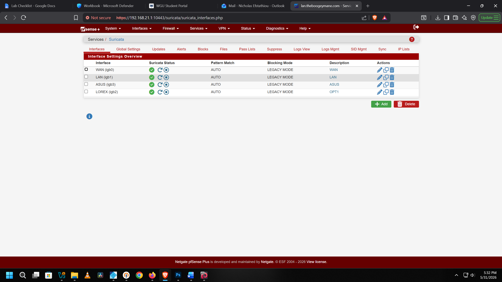

Suricata runs on **all four interfaces** (WAN, LAN, ASUS, LOREX) with independent inspection engines on each. Threat blocking is active, so malicious traffic gets dropped, not just flagged. GeoIP data comes from **MaxMind GeoLite2** so every alert includes source country context.

---

## 🚨 Suricata Live Threat Alerts

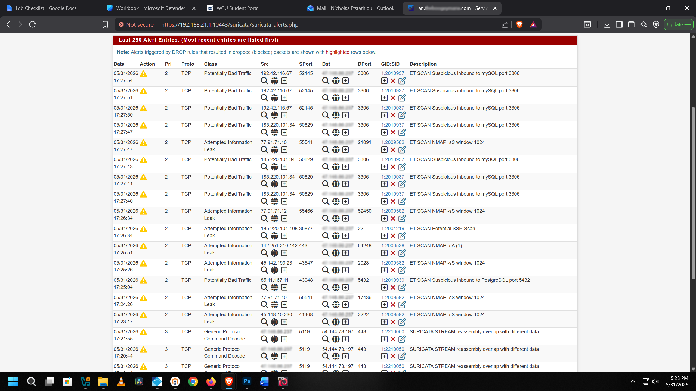

Live alert log with real detections including **port scans**, **MySQL/PostgreSQL probe attempts**, **NMAP scan detection**, and other recon activity. This is the IDS/IPS catching actual automated attacks hitting the network in real time.

---

## 🚫 pfBlockerNG IP Blocking & GeoIP

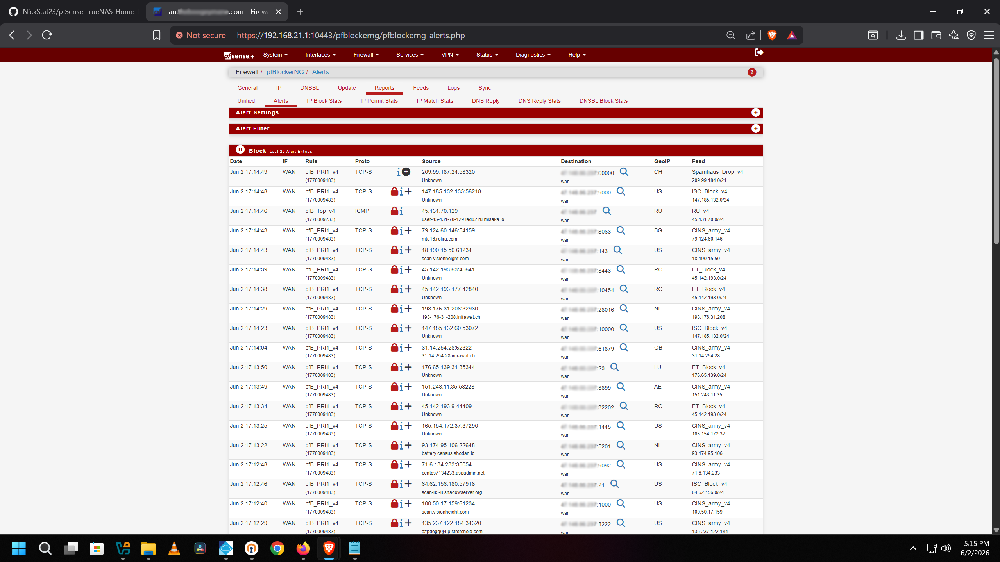

pfBlockerNG adds an IP reputation and GeoIP blocking layer on top of everything else. It pulls from multiple threat intelligence feeds and blocks known bad IPs at the firewall before they ever touch the network. Works alongside Pi-hole so if something slips through at the DNS layer, pfBlockerNG catches it at the network layer.

**Active threat feeds:**
- `CINS_army_v4`: CINS Army known bad actors
- `ET_Block_v4`: Emerging Threats IP blocklist
- `ISC_Block_v4`: SANS Internet Storm Center blocklist
- `Spamhaus_Drop_v4`: Spamhaus DROP list
- `RU_v4`: Russia GeoIP block

**Countries blocked in this snapshot:** CH, US (flagged IPs), RU, BG, RO, NL, GB, LU, AE

---

## 🗄️ TrueNAS Server Dashboard

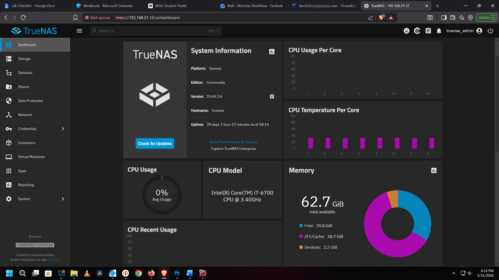

TrueNAS Scale running on dedicated bare-metal hardware:

- **CPU:** Intel Core i7-6700
- **RAM:** 62.7 GB
- **Storage:** 18TB across two drives
- **Role:** NAS + Type 1 KVM hypervisor running Plex, Pi-hole, and Nextcloud

---

## 📦 TrueNAS Installed Apps

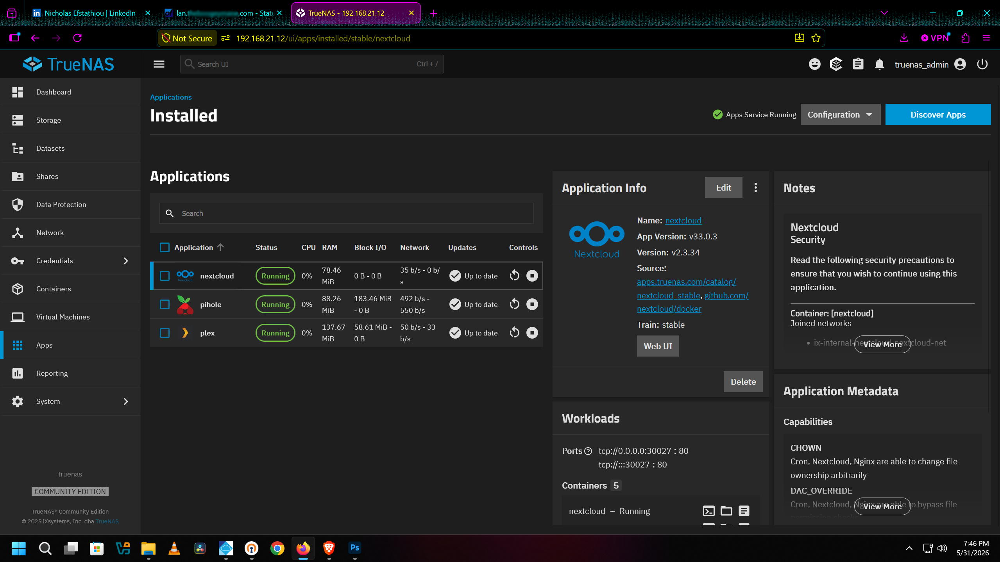

Containerized apps running on TrueNAS Scale:

- **Nextcloud**: private self-hosted cloud storage
- **Pi-hole**: network-wide DNS ad/tracker blocking
- **Plex**: local and remote media streaming

---

## ☁️ Nextcloud Private Cloud Storage

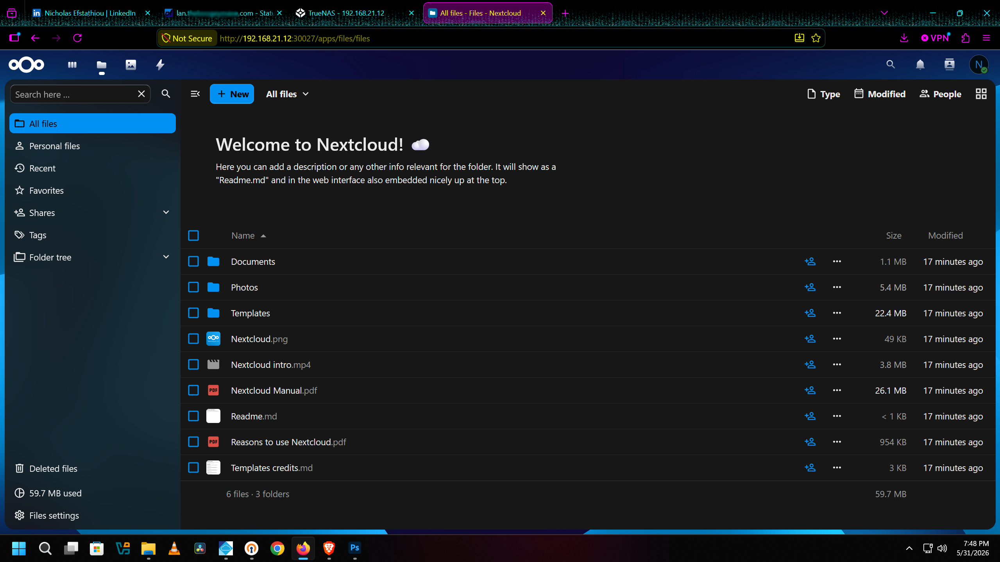

Nextcloud running on TrueNAS as a private alternative to Google Drive or iCloud. Access requires going through the **OpenVPN tunnel** and files never touch third-party infrastructure.

---

## 🚫 Pi-hole DNS Filtering

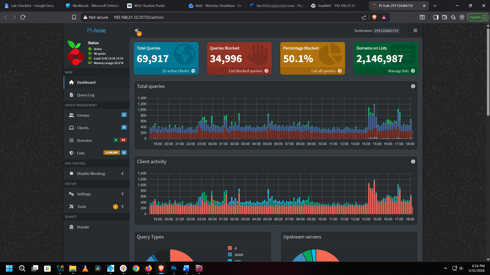

Pi-hole running on TrueNAS doing **network-wide DNS filtering** for every device on the network:

- **69,917** total DNS queries processed
- **34,996 blocked (50.1%)**: ads, trackers, and malicious domains
- **2,146,983 domains** on the blocklist
- Enforced via pfSense NAT rule so no device can bypass it

---

## 🎬 Plex Media Server

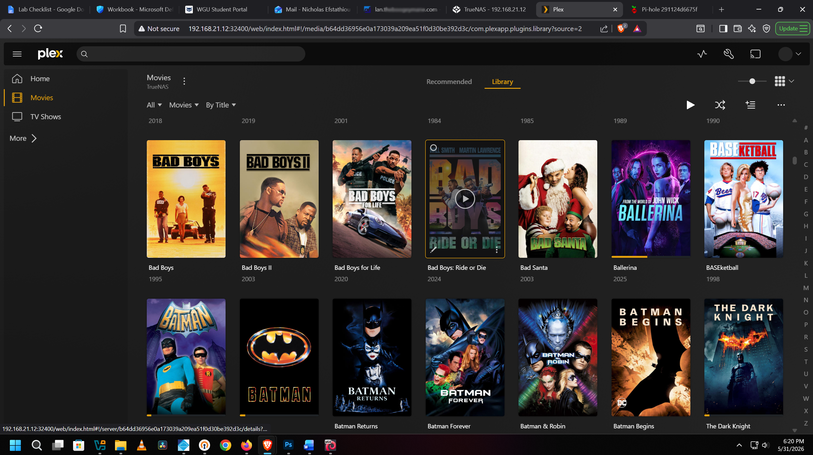

Plex running on TrueNAS serving a local media library across the home network and remotely through a port forward rule (TCP 32400) on the pfSense WAN.

---

## 🖥️ Type 1 Hypervisor & VM Deployment

TrueNAS Scale doubles as a **KVM-based Type 1 hypervisor**. Running an Ubuntu Desktop 22.04 VM with dedicated compute and storage for self-hosted security tooling and lab work directly on the NAS hardware.

---

## 🙋 Author

**Nicholas Efstathiou**  
Cybersecurity | Network Engineering | Home Lab  
[LinkedIn](https://www.linkedin.com/in/NickStat23)
